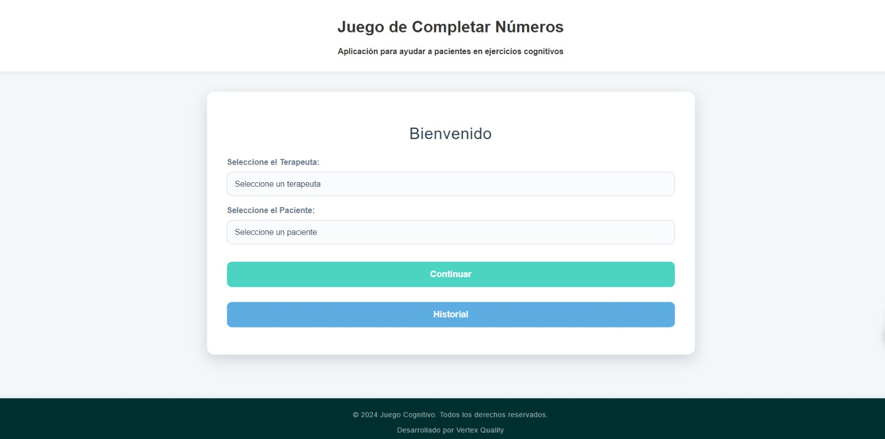
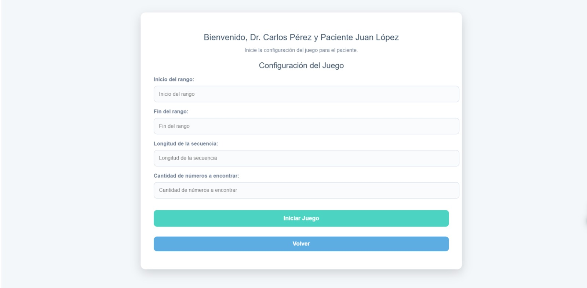
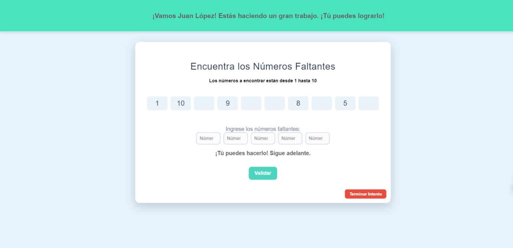

# 🧩 Juego de Secuencias Numéricas

¡Bienvenido al **Juego de Secuencias Numéricas**! Este proyecto está diseñado para ayudar a los usuarios a trabajar con secuencias y encontrar números faltantes, sirviendo como una herramienta lúdica y educativa.

## 📋 Tabla de Contenidos
- [Descripción del Proyecto](#descripcion-del-proyecto)
- [Tecnologías Utilizadas](#tecnologias-utilizadas)
- [Instalación](#instalacion)
- [Uso del Proyecto](#uso-del-proyecto)
- [Archivos y Estructura](#archivos-y-estructura)
- [Estilo Visual](#estilo-visual)
- [Autor](#autor)

## 📖 Descripción del Proyecto 
Este proyecto está orientado a permitir que los usuarios practiquen la identificación de patrones numéricos. Consiste en un juego donde los usuarios deben encontrar números que faltan en una secuencia numérica generada aleatoriamente. Está pensado para mejorar la agilidad mental y ayudar a terapeutas a usarlo como una herramienta terapéutica.

## 🚀 Tecnologías Utilizadas 
- **HTML5**: Estructuración del contenido.
- **CSS3**: Estilización de la interfaz para hacerla más atractiva y moderna.
- **JavaScript**: Lógica del juego y gestión de la interfaz de usuario.

## 🛠 Instalación 
Para utilizar este proyecto, simplemente sigue estos pasos:

1. Abre el archivo `login.html` en tu navegador favorito para comenzar.

## 🎮 Uso del Proyecto 
1. **Pantalla de Login**: 
   - Ingresa el ID del terapeuta y el ID del paciente. Haz clic en **Continuar** para ir a la configuración del juego.
   - También puedes revisar el historial haciendo clic en **Historial**.

   

2. **Configuración del Juego**:
   - Selecciona el rango de números, la longitud de la secuencia, y la cantidad de números que deseas encontrar.
   - Haz clic en **Iniciar Juego**.

   

3. **Pantalla de Juego**:
   - Encuentra los números que faltan en la secuencia. Los inputs se habilitarán uno por uno a medida que completes correctamente cada número.
   - Haz clic en **Validar** para comprobar cada respuesta.

   

4. **Pantalla de Resultados**:
   - Al finalizar el juego, se muestra un resumen de los errores cometidos y una caja de texto para observaciones.
   - Puedes **Guardar** el resultado, volver a intentar o comenzar una nueva partida.

   

## 🌟 Estilo Visual 
Para hacer que el juego sea más atractivo y divertido, se ha usado CSS para crear un diseño limpio y amigable. Cada botón tiene colores llamativos para guiar intuitivamente al usuario en la experiencia del juego. A continuación, algunos ejemplos de estilo:

## 🤖 Desarrollado por Vertex Quality
Este proyecto fue creado con pasión por **Vertex Quality** 🌀, buscando aportar diversión y aprendizaje a través de la práctica de secuencias numéricas. 

¿Tienes alguna idea o simplemente quieres decir hola? 🌟
¡No dudes en contactarnos! 📧 [contact@vertexquality.com](mailto:contact@vertexquality.com)

